# Working Test Application - Architecture Documentation

## Table of Contents
1. [System Architecture Overview](#system-architecture-overview)
2. [Component Diagram](#component-diagram)
3. [Data Model Diagram](#data-model-diagram)
4. [Blueprint Architecture](#blueprint-architecture)
5. [Key Sequence Diagrams](#key-sequence-diagrams)
6. [Technology Stack](#technology-stack)

---

## System Architecture Overview

The Working Test application is built as a modular Flask application with a layered architecture:

- **Presentation Layer**: Jinja2 templates with Bootstrap CSS
- **Application Layer**: Flask blueprints organized by feature
- **Business Logic Layer**: Route handlers with role-based access control
- **Data Access Layer**: SQLAlchemy ORM models
- **Persistence Layer**: SQLite database

### Architecture Principles

- **Modularity**: Features organized into separate blueprints
- **Reusability**: Template macros for consistent UI components
- **Security**: Role-based access control (RBAC) throughout
- **Separation of Concerns**: Models, routes, and templates kept separate

---

## Component Diagram

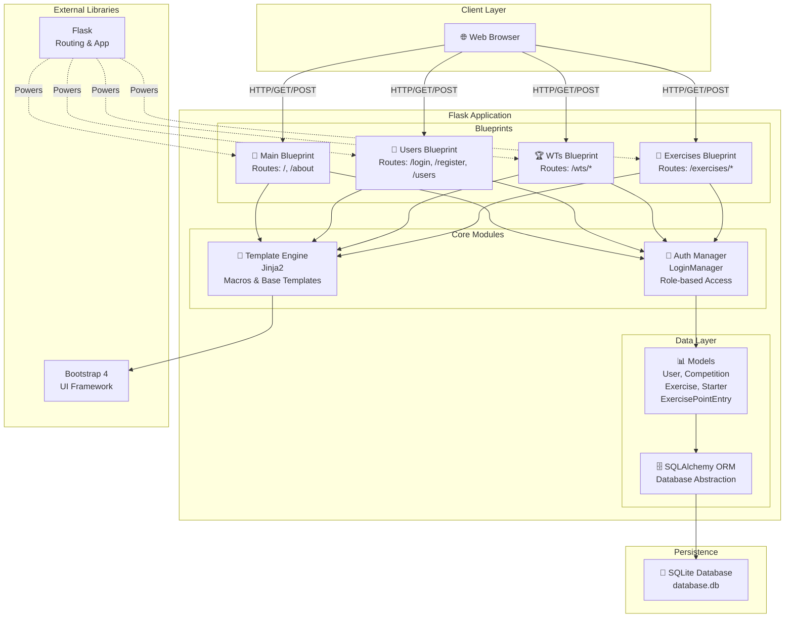
```mermaid
graph TB
    subgraph "Client Layer"
        Browser["🌐 Web Browser"]
    end
    
    subgraph "Flask Application"
        subgraph "Blueprints"
            Main["📄 Main Blueprint<br/>Routes: /, /about"]
            Users["👤 Users Blueprint<br/>Routes: /login, /register, /users"]
            WTs["🏆 WTs Blueprint<br/>Routes: /wts/*"]
            Exercises["🎯 Exercises Blueprint<br/>Routes: /exercises/*"]
        end
        
        subgraph "Core Modules"
            Auth["🔐 Auth Manager<br/>LoginManager<br/>Role-based Access"]
            Templates["🎨 Template Engine<br/>Jinja2<br/>Macros & Base Templates"]
        end
        
        subgraph "Data Layer"
            Models["📊 Models<br/>User, Competition<br/>Exercise, Starter<br/>ExercisePointEntry"]
            ORM["🗄️ SQLAlchemy ORM<br/>Database Abstraction"]
        end
    end
    
    subgraph "Persistence"
        Database["💾 SQLite Database<br/>database.db"]
    end
    
    subgraph "External Libraries"
        Flask["Flask<br/>Routing & App"]
        BootStrap["Bootstrap 4<br/>UI Framework"]
    end
    
    Browser -->|HTTP/GET/POST| Main
    Browser -->|HTTP/GET/POST| Users
    Browser -->|HTTP/GET/POST| WTs
    Browser -->|HTTP/GET/POST| Exercises
    
    Main --> Auth
    Users --> Auth
    WTs --> Auth
    Exercises --> Auth
    
    Main --> Templates
    Users --> Templates
    WTs --> Templates
    Exercises --> Templates
    
    Auth --> Models
    Models --> ORM
    ORM --> Database
    
    Templates --> BootStrap
    
    Flask -.->|Powers| Main
    Flask -.->|Powers| Users
    Flask -.->|Powers| WTs
    Flask -.->|Powers| Exercises
```

---

## Data Model Diagram

```mermaid
erDiagram
    USER ||--o{ EXERCISE : judges
    USER ||--o{ EXERCISE : helps
    USER ||--o{ PERSON : ""
    
    PERSON ||--o{ STARTER : participates
    DOG ||--o{ STARTER : ""
    
    COMPETITION ||--o{ EXERCISE : contains
    COMPETITION ||--o{ STARTER : hosts
    COMPETITION ||--|| COMPETITION_RESULT : has
    
    STARTER ||--o{ EXERCISE_POINT_ENTRY : submits
    STARTER ||--o{ EXERCISE_RESULT : has
    
    EXERCISE ||--o{ EXERCISE_POINT_ENTRY : receives
    EXERCISE ||--o{ EXERCISE_RESULT : produces
    
    USER {
        int id PK
        string username UK
        string password_hash
        string role "admin, organizer, helper, visitor"
    }
    
    PERSON {
        int id PK
        string given_name
        string family_name
        string email
    }
    
    DOG {
        int id PK
        string name
        string breed
        string kennel
    }
    
    COMPETITION {
        int id PK
        string name
        string level "A, F, O"
        string location
        date date
    }
    
    STARTER {
        int id PK
        int person_id FK
        int dog_id FK
        int competition_id FK
        boolean paid
        boolean present
        text notes
    }
    
    EXERCISE {
        int id PK
        string name
        int competition_id FK
        int judge_id FK
        int helper_id FK
        int max_points
    }
    
    EXERCISE_POINT_ENTRY {
        int id PK
        int exercise_id FK
        int starter_id FK
        int points
        text notes
        datetime created_at
        datetime updated_at
    }
    
    EXERCISE_RESULT {
        int id PK
        int exercise_id FK
        int starter_id FK
        int points
        boolean published
    }
    
    COMPETITION_RESULT {
        int id PK
        int competition_id FK UK
        boolean published
        datetime published_at
    }
```

---

## Blueprint Architecture

### File Structure

```
app/
├── __init__.py                 # App factory, blueprint registration
├── models.py                   # SQLAlchemy models
│
├── templates/
│   ├── base.html              # Base template
│   ├── macros.html            # Reusable macros (12 macros)
│   └── ...
│
└── blueprints/
    ├── main/
    │   ├── __init__.py        # Blueprint definition
    │   ├── routes.py          # Index, about routes
    │   └── templates/
    │
    ├── users/
    │   ├── __init__.py        # Blueprint definition
    │   ├── routes.py          # Login, register, user management
    │   └── templates/
    │
    ├── wts/
    │   ├── __init__.py        # Blueprint definition
    │   ├── routes.py          # Create, view, delete working tests
    │   └── templates/
    │
    └── exercises/             # NEW: Exercise management
        ├── __init__.py        # Blueprint definition
        ├── routes.py          # Exercise CRUD, point entry, results
        └── templates/
            ├── wt_exercises.html
            ├── add_exercise.html
            ├── edit_exercise.html
            ├── exercise_point_entry.html
            └── competition_results.html
```

### Blueprint Responsibilities

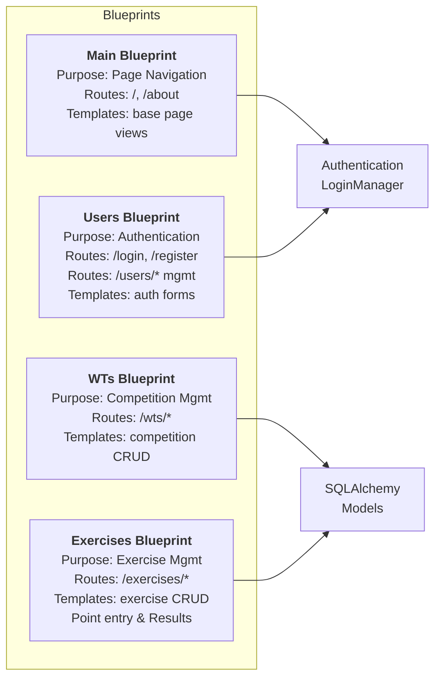
```mermaid
graph LR
    subgraph Blueprints
        Main["<b>Main Blueprint</b><br/>Purpose: Page Navigation<br/>Routes: /, /about<br/>Templates: base page views"]
        
        Users["<b>Users Blueprint</b><br/>Purpose: Authentication<br/>Routes: /login, /register<br/>Routes: /users/* mgmt<br/>Templates: auth forms"]
        
        WTs["<b>WTs Blueprint</b><br/>Purpose: Competition Mgmt<br/>Routes: /wts/*<br/>Templates: competition CRUD"]
        
        Exercises["<b>Exercises Blueprint</b><br/>Purpose: Exercise Mgmt<br/>Routes: /exercises/*<br/>Templates: exercise CRUD<br/>Point entry & Results"]
    end
    
    Auth["Authentication<br/>LoginManager"]
    DB["SQLAlchemy<br/>Models"]
    
    Main --> Auth
    Users --> Auth
    WTs --> DB
    Exercises --> DB
```

---

## Key Sequence Diagrams

### 1. User Login Flow

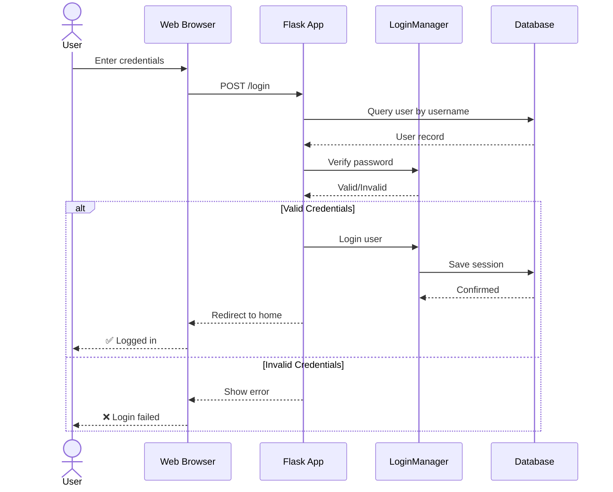
```mermaid
sequenceDiagram
    actor User
    participant Browser as Web Browser
    participant Flask as Flask App
    participant Auth as LoginManager
    participant DB as Database
    
    User->>Browser: Enter credentials
    Browser->>Flask: POST /login
    
    Flask->>DB: Query user by username
    DB-->>Flask: User record
    
    Flask->>Auth: Verify password
    Auth-->>Flask: Valid/Invalid
    
    alt Valid Credentials
        Flask->>Auth: Login user
        Auth->>DB: Save session
        DB-->>Auth: Confirmed
        Flask-->>Browser: Redirect to home
        Browser-->>User: ✅ Logged in
    else Invalid Credentials
        Flask-->>Browser: Show error
        Browser-->>User: ❌ Login failed
    end
```

### 2. Exercise Management Flow

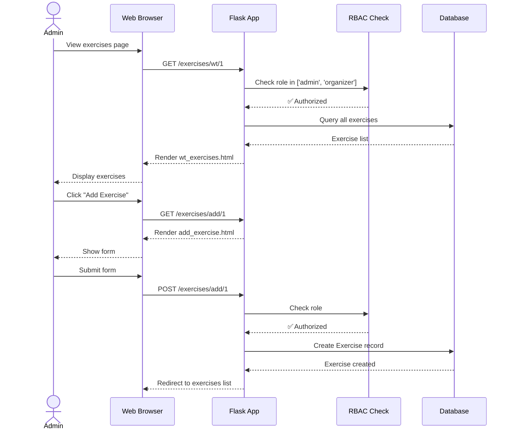
```mermaid
sequenceDiagram
    actor Admin
    participant Browser as Web Browser
    participant Flask as Flask App
    participant Auth as RBAC Check
    participant DB as Database
    
    Admin->>Browser: View exercises page
    Browser->>Flask: GET /exercises/wt/1
    
    Flask->>Auth: Check role in ['admin', 'organizer']
    Auth-->>Flask: ✅ Authorized
    
    Flask->>DB: Query all exercises
    DB-->>Flask: Exercise list
    Flask-->>Browser: Render wt_exercises.html
    Browser-->>Admin: Display exercises
    
    Admin->>Browser: Click "Add Exercise"
    Browser->>Flask: GET /exercises/add/1
    Flask-->>Browser: Render add_exercise.html
    Browser-->>Admin: Show form
    
    Admin->>Browser: Submit form
    Browser->>Flask: POST /exercises/add/1
    
    Flask->>Auth: Check role
    Auth-->>Flask: ✅ Authorized
    
    Flask->>DB: Create Exercise record
    DB-->>Flask: Exercise created
    Flask-->>Browser: Redirect to exercises list
```

### 3. Point Entry Flow

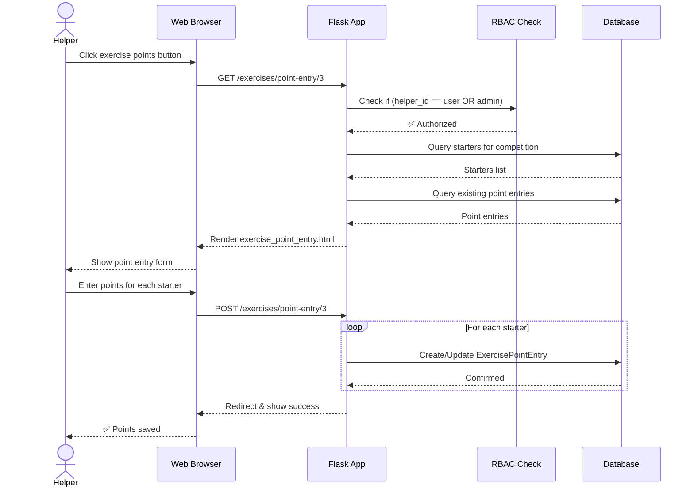
```mermaid
sequenceDiagram
    actor Helper
    participant Browser as Web Browser
    participant Flask as Flask App
    participant Auth as RBAC Check
    participant DB as Database
    
    Helper->>Browser: Click exercise points button
    Browser->>Flask: GET /exercises/point-entry/3
    
    Flask->>Auth: Check if (helper_id == user OR admin)
    Auth-->>Flask: ✅ Authorized
    
    Flask->>DB: Query starters for competition
    DB-->>Flask: Starters list
    
    Flask->>DB: Query existing point entries
    DB-->>Flask: Point entries
    
    Flask-->>Browser: Render exercise_point_entry.html
    Browser-->>Helper: Show point entry form
    
    Helper->>Browser: Enter points for each starter
    Browser->>Flask: POST /exercises/point-entry/3
    
    loop For each starter
        Flask->>DB: Create/Update ExercisePointEntry
        DB-->>Flask: Confirmed
    end
    
    Flask-->>Browser: Redirect & show success
    Browser-->>Helper: ✅ Points saved
```

### 4. Results Publication Flow

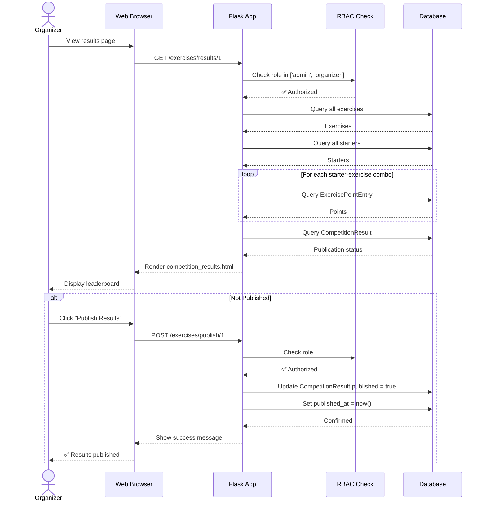
```mermaid
sequenceDiagram
    actor Organizer
    participant Browser as Web Browser
    participant Flask as Flask App
    participant Auth as RBAC Check
    participant DB as Database
    
    Organizer->>Browser: View results page
    Browser->>Flask: GET /exercises/results/1
    
    Flask->>Auth: Check role in ['admin', 'organizer']
    Auth-->>Flask: ✅ Authorized
    
    Flask->>DB: Query all exercises
    DB-->>Flask: Exercises
    
    Flask->>DB: Query all starters
    DB-->>Flask: Starters
    
    loop For each starter-exercise combo
        Flask->>DB: Query ExercisePointEntry
        DB-->>Flask: Points
    end
    
    Flask->>DB: Query CompetitionResult
    DB-->>Flask: Publication status
    
    Flask-->>Browser: Render competition_results.html
    Browser-->>Organizer: Display leaderboard
    
    alt Not Published
        Organizer->>Browser: Click "Publish Results"
        Browser->>Flask: POST /exercises/publish/1
        
        Flask->>Auth: Check role
        Auth-->>Flask: ✅ Authorized
        
        Flask->>DB: Update CompetitionResult.published = true
        Flask->>DB: Set published_at = now()
        DB-->>Flask: Confirmed
        
        Flask-->>Browser: Show success message
        Browser-->>Organizer: ✅ Results published
    end
```

### 5. Visitor Views Results Flow

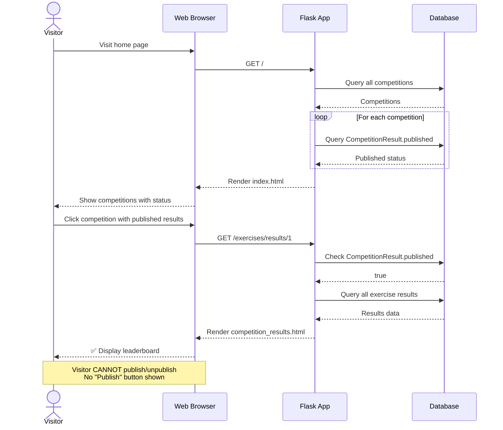
```mermaid
sequenceDiagram
    actor Visitor
    participant Browser as Web Browser
    participant Flask as Flask App
    participant DB as Database
    
    Visitor->>Browser: Visit home page
    Browser->>Flask: GET /
    
    Flask->>DB: Query all competitions
    DB-->>Flask: Competitions
    
    loop For each competition
        Flask->>DB: Query CompetitionResult.published
        DB-->>Flask: Published status
    end
    
    Flask-->>Browser: Render index.html
    Browser-->>Visitor: Show competitions with status
    
    Visitor->>Browser: Click competition with published results
    Browser->>Flask: GET /exercises/results/1
    
    Flask->>DB: Check CompetitionResult.published
    DB-->>Flask: true
    
    Flask->>DB: Query all exercise results
    DB-->>Flask: Results data
    
    Flask-->>Browser: Render competition_results.html
    Browser-->>Visitor: ✅ Display leaderboard
    
    Note over Visitor,Browser: Visitor CANNOT publish/unpublish<br/>No "Publish" button shown
```

---

## Template Macro Architecture

### Generic Details Macro (`generic_details.html.jinja`)

A new generic template file provides a single `generic_details` macro that replaces separate
detail/edit/new user templates with a unified approach:

```
app/templates/generic_details.html.jinja
```

**Macro signature**: `generic_details(data, edit=false, show_flash=true)`

| Parameter | Type | Description |
|-----------|------|-------------|
| `data` | dict/JSON | Structure describing fields and buttons (see below) |
| `edit` | bool | `false` = read-only detail view; `true` = editable form view |
| `show_flash` | bool | Whether to show Flask flash messages (default `true`) |

**`data` JSON structure**:
```json
{
  "title": "...",
  "form_action": "...",
  "fields": [
    {
      "name": "...",
      "label": "...",
      "value": "...",
      "type": "text|password|email|number|select|textarea",
      "options": [["value", "Display Text"]],
      "required": false,
      "placeholder": ""
    }
  ],
  "buttons": [
    {
      "type": "link|submit|form",
      "label": "...",
      "url": "...",
      "style": "primary|secondary|danger|...",
      "confirm": "..."
    }
  ]
}
```

**Usage in user templates**:
- `detail.html.jinja` – calls `generic_details(data)` (edit=false for read-only view)
- `edit.html.jinja` – calls `generic_details(data, edit=true)` for editable form
- `register.html.jinja` – calls `generic_details(data, edit=true)` for new user form

The macro is fully generic and can be used for any entity type by supplying the appropriate `data` structure.

### Macro Organization

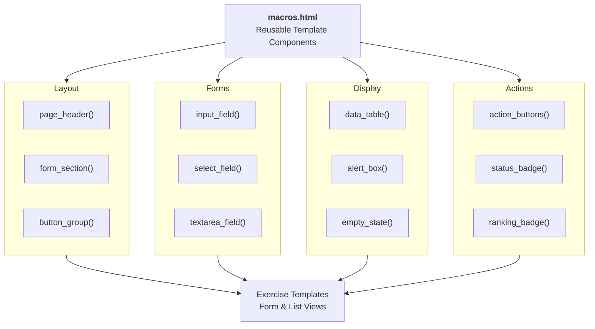
```mermaid
graph TD
    macros["<b>macros.html</b><br/>Reusable Template Components"]
    
    subgraph Layout
        header["page_header()"]
        form["form_section()"]
        section["button_group()"]
    end
    
    subgraph Forms
        input["input_field()"]
        select["select_field()"]
        textarea["textarea_field()"]
    end
    
    subgraph Display
        table["data_table()"]
        alert["alert_box()"]
        empty["empty_state()"]
    end
    
    subgraph Actions
        buttons["action_buttons()"]
        badge["status_badge()"]
        rank["ranking_badge()"]
    end
    
    macros --> Layout
    macros --> Forms
    macros --> Display
    macros --> Actions
    
    Layout --> Templates["Exercise Templates<br/>Form & List Views"]
    Forms --> Templates
    Display --> Templates
    Actions --> Templates
```

### Macro Dependencies

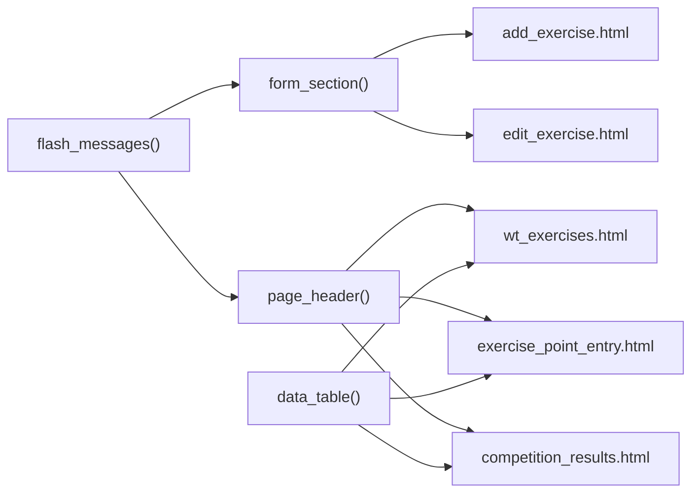
```mermaid
graph LR
    flash["flash_messages()"]
    
    form_section["form_section()"]
    page_header["page_header()"]
    data_table["data_table()"]
    
    add_ex["add_exercise.html"]
    edit_ex["edit_exercise.html"]
    wt_ex["wt_exercises.html"]
    point_entry["exercise_point_entry.html"]
    results["competition_results.html"]
    
    flash --> form_section
    flash --> page_header
    
    form_section --> add_ex
    form_section --> edit_ex
    
    page_header --> wt_ex
    page_header --> point_entry
    page_header --> results
    
    data_table --> wt_ex
    data_table --> point_entry
    data_table --> results
```

---

## Access Control Architecture

### Role-Based Access Control (RBAC) Matrix

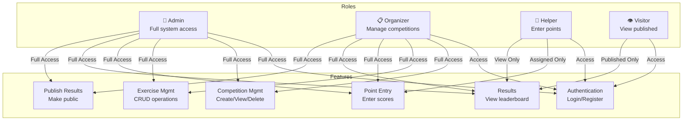
```mermaid
graph TB
    subgraph Roles
        Admin["👑 Admin<br/>Full system access"]
        Org["📋 Organizer<br/>Manage competitions"]
        Helper["🤝 Helper<br/>Enter points"]
        Visitor["👁️ Visitor<br/>View published"]
    end
    
    subgraph Features
        Auth["Authentication<br/>Login/Register"]
        CompMgmt["Competition Mgmt<br/>Create/View/Delete"]
        ExMgmt["Exercise Mgmt<br/>CRUD operations"]
        PointEntry["Point Entry<br/>Enter scores"]
        Results["Results<br/>View leaderboard"]
        Publish["Publish Results<br/>Make public"]
    end
    
    Admin -->|Full Access| Auth
    Admin -->|Full Access| CompMgmt
    Admin -->|Full Access| ExMgmt
    Admin -->|Full Access| PointEntry
    Admin -->|Full Access| Results
    Admin -->|Full Access| Publish
    
    Org -->|Access| Auth
    Org -->|Full Access| CompMgmt
    Org -->|Full Access| ExMgmt
    Org -->|Full Access| PointEntry
    Org -->|Full Access| Results
    Org -->|Full Access| Publish
    
    Helper -->|Access| Auth
    Helper -->|Assigned Only| PointEntry
    Helper -->|View Only| Results
    
    Visitor -->|Access| Auth
    Visitor -->|Published Only| Results
```

### Route Protection Pattern

```python
# Protection layers in routes:

@bp.route('/exercises/wt/<int:competition_id>')
@login_required                           # Layer 1: Authentication
def wt_exercises(competition_id):
    if current_user.role not in ['admin', 'organizer', 'helper']:
        abort(403)                        # Layer 2: Role check
    
    if current_user.role == 'helper':
        exercises = Exercise.query.filter_by(
            competition_id=competition_id,
            helper_id=current_user.id     # Layer 3: Data-level filtering
        ).all()
    else:
        exercises = Exercise.query.filter_by(
            competition_id=competition_id
        ).all()
```

---

## Data Flow Architecture

### Exercise Point Entry Data Flow


```mermaid
graph LR
    subgraph Input
        Form["📝 HTML Form<br/>Point input fields"]
    end
    
    subgraph Validation
        ClientVal["Frontend Validation<br/>min=0, max=max_points"]
        ServerVal["Backend Validation<br/>Range check"]
    end
    
    subgraph Processing
        Parse["Parse Form Data<br/>Extract points & notes"]
        Check["Permission Check<br/>Verify helper assignment"]
        CreateUpdate["Create/Update<br/>ExercisePointEntry"]
    end
    
    subgraph Storage
        DB["SQLite Database<br/>ExercisePointEntry table"]
    end
    
    subgraph Output
        Response["Flash Message<br/>Success confirmation"]
        Redirect["Redirect<br/>Back to exercises"]
    end
    
    Form --> ClientVal
    ClientVal --> ServerVal
    ServerVal --> Parse
    Parse --> Check
    Check --> CreateUpdate
    CreateUpdate --> DB
    DB --> Response
    Response --> Redirect
```

### Results Calculation Data Flow

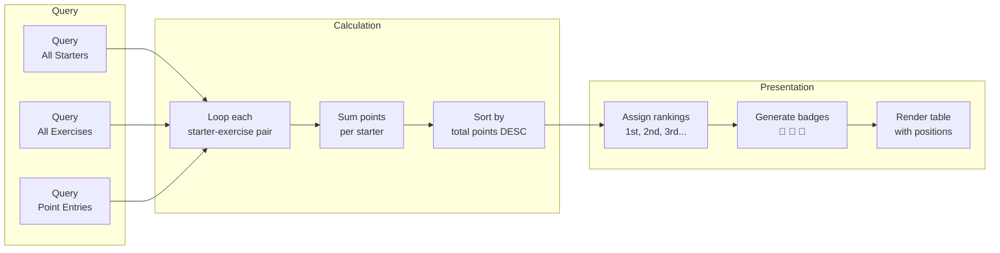
```mermaid
graph LR
    subgraph Query
        Starters["Query<br/>All Starters"]
        Exercises["Query<br/>All Exercises"]
        PointEntries["Query<br/>Point Entries"]
    end
    
    subgraph Calculation
        Loop["Loop each<br/>starter-exercise pair"]
        Sum["Sum points<br/>per starter"]
        Sort["Sort by<br/>total points DESC"]
    end
    
    subgraph Presentation
        Ranking["Assign rankings<br/>1st, 2nd, 3rd..."]
        Badges["Generate badges<br/>🥇 🥈 🥉"]
        Render["Render table<br/>with positions"]
    end
    
    Starters --> Loop
    Exercises --> Loop
    PointEntries --> Loop
    Loop --> Sum
    Sum --> Sort
    Sort --> Ranking
    Ranking --> Badges
    Badges --> Render
```

---

## Technology Stack

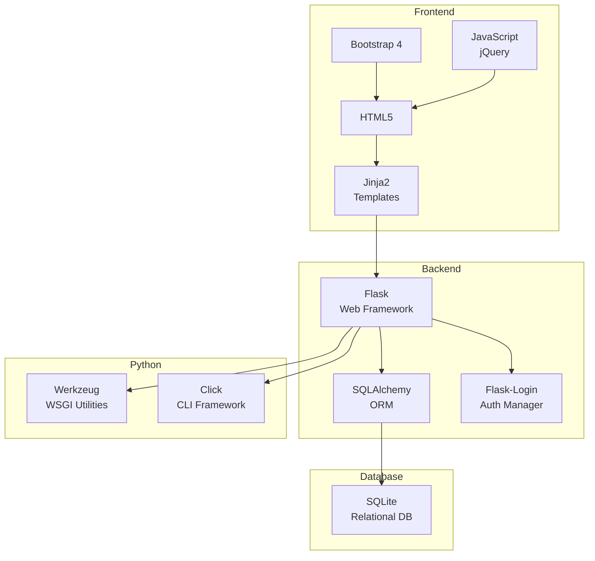
```mermaid
graph TB
    subgraph Frontend
        HTML["HTML5"]
        CSS["Bootstrap 4"]
        JS["JavaScript<br/>jQuery"]
        Jinja["Jinja2<br/>Templates"]
    end
    
    subgraph Backend
        Flask["Flask<br/>Web Framework"]
        SQLAlchemy["SQLAlchemy<br/>ORM"]
        Login["Flask-Login<br/>Auth Manager"]
    end
    
    subgraph Database
        SQLite["SQLite<br/>Relational DB"]
    end
    
    subgraph Python
        Werkzeug["Werkzeug<br/>WSGI Utilities"]
        Click["Click<br/>CLI Framework"]
    end
    
    HTML --> Jinja
    CSS --> HTML
    JS --> HTML
    Jinja --> Flask
    
    Flask --> SQLAlchemy
    Flask --> Login
    SQLAlchemy --> SQLite
    
    Flask --> Werkzeug
    Flask --> Click
```

---

## Deployment Architecture

### Application Stack

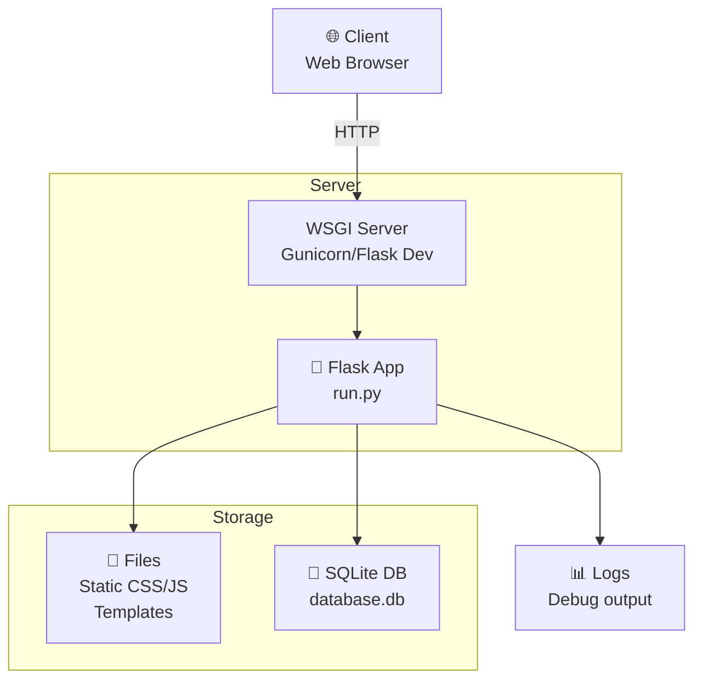
```mermaid
graph TB
    Client["🌐 Client<br/>Web Browser"]
    
    subgraph Server
        WSGI["WSGI Server<br/>Gunicorn/Flask Dev"]
        App["🐍 Flask App<br/>run.py"]
    end
    
    subgraph Storage
        Files["📁 Files<br/>Static CSS/JS<br/>Templates"]
        DB["💾 SQLite DB<br/>database.db"]
    end
    
    Logs["📊 Logs<br/>Debug output"]
    
    Client -->|HTTP| WSGI
    WSGI --> App
    App --> Files
    App --> DB
    App --> Logs
```

### Startup Sequence

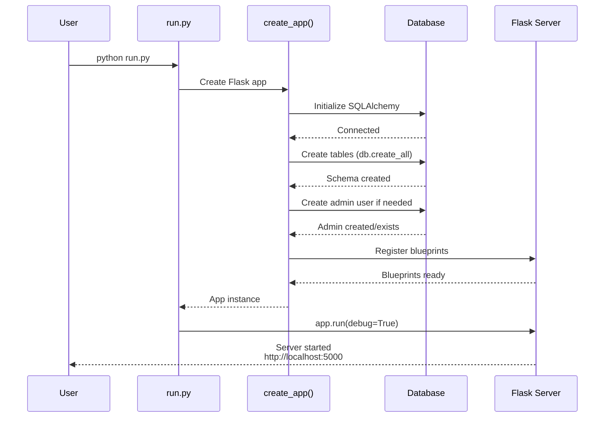
```mermaid
sequenceDiagram
    participant User
    participant Main as run.py
    participant Factory as create_app()
    participant DB as Database
    participant Flask as Flask Server
    
    User->>Main: python run.py
    Main->>Factory: Create Flask app
    
    Factory->>DB: Initialize SQLAlchemy
    DB-->>Factory: Connected
    
    Factory->>DB: Create tables (db.create_all)
    DB-->>Factory: Schema created
    
    Factory->>DB: Create admin user if needed
    DB-->>Factory: Admin created/exists
    
    Factory->>Flask: Register blueprints
    Flask-->>Factory: Blueprints ready
    
    Factory-->>Main: App instance
    Main->>Flask: app.run(debug=True)
    Flask-->>User: Server started<br/>http://localhost:5000
```

---

## Security Architecture

### Authentication & Authorization Flow

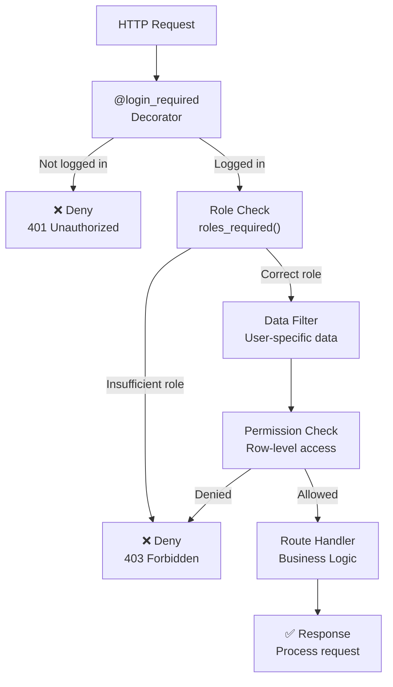
```mermaid
graph TD
    Request["HTTP Request"]
    
    Auth1["@login_required<br/>Decorator"]
    Auth2["Role Check<br/>roles_required()"]
    Auth3["Data Filter<br/>User-specific data"]
    Auth4["Permission Check<br/>Row-level access"]
    
    Handler["Route Handler<br/>Business Logic"]
    
    Deny1["❌ Deny<br/>401 Unauthorized"]
    Deny2["❌ Deny<br/>403 Forbidden"]
    
    Response["✅ Response<br/>Process request"]
    
    Request --> Auth1
    Auth1 -->|Not logged in| Deny1
    Auth1 -->|Logged in| Auth2
    
    Auth2 -->|Insufficient role| Deny2
    Auth2 -->|Correct role| Auth3
    
    Auth3 --> Auth4
    Auth4 -->|Denied| Deny2
    Auth4 -->|Allowed| Handler
    
    Handler --> Response
```

### Password Security

```
User Password
    ↓
werkzeug.security.generate_password_hash()
    ↓
Hashed with PBKDF2 (Werkzeug default)
    ↓
Stored in database
    ↓
On Login: werkzeug.security.check_password_hash()
    ↓
Compare hashes (NOT plain text)
```

---

## Development Workflow

### Feature Development Flow

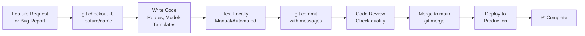
```mermaid
graph LR
    Start["Feature Request<br/>or Bug Report"]
    
    Branch["git checkout -b<br/>feature/name"]
    
    Code["Write Code<br/>Routes, Models<br/>Templates"]
    
    Test["Test Locally<br/>Manual/Automated"]
    
    Commit["git commit<br/>with messages"]
    
    Review["Code Review<br/>Check quality"]
    
    Merge["Merge to main<br/>git merge"]
    
    Deploy["Deploy to<br/>Production"]
    
    Done["✅ Complete"]
    
    Start --> Branch
    Branch --> Code
    Code --> Test
    Test --> Commit
    Commit --> Review
    Review --> Merge
    Merge --> Deploy
    Deploy --> Done
```

---

## Selenium Test Suite Architecture

### Test Organization

The Selenium tests are organized by page and functionality, using Robot Framework with SeleniumLibrary:

```
tests/selenium/
├── __init__.robot                    # Suite setup/teardown (database reset, app startup)
├── test_user_login.robot             # ✅ DONE: Login, logout, competition creation
├── test_wt_details_delete.robot      # ✅ DONE: Working test details, deletion
├── test_unauthenticated_results.robot # ✅ DONE: Results page access control
├── test_index_page.robot             # ✅ DONE: Index page display & navigation (11 tests)
├── test_exercises_management.robot   # TODO: Exercise CRUD operations
├── test_point_entry.robot            # TODO: Point entry functionality
├── test_results_publication.robot    # TODO: Results publish/unpublish
└── test_access_control.robot         # TODO: Role-based access verification
```

### Test Coverage by Page

| Page | Route | Test File | Status | Test Cases |
|------|-------|-----------|--------|------------|
| Index | `/` | test_index_page.robot | ✅ DONE | 11 |
| About | `/about` | test_main_pages.robot | TODO | - |
| Login | `/users/login` | test_user_login.robot | ✅ DONE | 2 |
| Register | `/users/register` | test_user_registration.robot | TODO | - |
| User Management | `/users/*` | test_user_management.robot | ✅ DONE | 4 |
| WT Details | `/wts/details/<id>` | test_wt_details_delete.robot | ✅ DONE | 2 |
| Create WT | `/wts/create_wt` | test_wt_details_delete.robot | ✅ DONE | - |
| Exercises | `/exercises/wt/<id>` | test_exercises_management.robot | TODO | - |
| Add Exercise | `/exercises/add/<id>` | test_exercise_add.robot | TODO | - |
| Edit Exercise | `/exercises/edit/<id>` | test_exercise_edit.robot | TODO | - |
| Point Entry | `/exercises/point_entry/<id>` | test_point_entry.robot | TODO | - |
| Results | `/exercises/results/<id>` | test_results_publication.robot | TODO | - |

### Index Page Test Cases (test_index_page.robot)

1. ✅ Index Page Displays Title - Verifies "Workingtest Planer" title
2. ✅ Index Page Displays All Competitions - Shows competition list
3. ✅ Index Page Displays Competition Details - Shows columns: Competition, Class, Location, Date
4. ✅ Index Page Empty State - Tests behavior with no competitions
5. ✅ Index Page Competition Link Navigation - Admin login and access
6. ✅ Index Page Admin Can See Create Button - Admin page access
7. ✅ Index Page Unauthenticated User Can View Results - Public index access
8. ✅ Index Page Authenticated User Access - Authenticated user view
9. ✅ Index Page Table Structure - Verifies table columns
10. ✅ Index Page Responsive Design - Tests mobile, tablet, desktop layouts
11. ✅ Index Page Multiple Competitions Display - Shows multiple competitions

### Test Infrastructure

**Environment Setup** (from `__init__.robot`):
- Suite Setup: Database reset and web app startup
- Suite Teardown: Stop web app
- Database reset: Full database drop/recreate with admin user (username: admin, password: admin)
- Web App: Started with Python run.py, 5-second startup wait

**Browser Configuration**:
- Browser: headlesschrome (Chrome in headless mode)
- Default window size: 1920x1080
- Timeouts: 10-15 seconds for page load waits

**Page Object Keywords**:
- `Login With Admin User` - Authenticates as admin user
- `Start Web App` - Starts Flask development server

### Test Execution

Run tests with:
```bash
source .venv/bin/activate
robot -L TRACE -d test_results tests/selenium/test_index_page.robot
```

Results:
- Log: `test_results/log.html`
- Report: `test_results/report.html`
- Output: `test_results/output.xml`

---

## Performance Considerations

### Database Query Optimization

- **Lazy Loading**: Use `lazy=True` for foreign key relationships
- **Eager Loading**: Use `lazy='joined'` for frequently accessed relationships
- **Indexing**: Primary keys auto-indexed, consider adding indexes on frequently filtered columns
- **N+1 Query Prevention**: Use relationship loading strategies properly

### Caching Strategies

- **Template Caching**: Jinja2 caches compiled templates
- **Database Connection**: SQLAlchemy connection pooling
- **Static Files**: Browser caching with Cache-Control headers

### Scalability Notes

- **Current State**: Single-process Flask development server
- **Production**: Use Gunicorn + Nginx for better performance
- **Database**: SQLite suitable for small/medium teams; consider PostgreSQL for larger deployments
- **Session Store**: Use database or Redis for distributed systems

---

## Summary

This architecture provides:

✅ **Clear Separation of Concerns** - Models, routes, templates separated  
✅ **Modular Design** - Features in dedicated blueprints  
✅ **Reusable Components** - 12 template macros reduce code duplication  
✅ **Security** - Multi-layer authentication and authorization  
✅ **Scalability** - Clean structure allows adding new features  
✅ **Maintainability** - Well-organized codebase easy to understand and modify  

