# Working Test Application - Architecture Documentation

## Table of Contents
1. [System Architecture Overview](#system-architecture-overview)
2. [Component Diagram](#component-diagram)
3. [Data Model Diagram](#data-model-diagram)
4. [Blueprint Architecture](#blueprint-architecture)
5. [Key Sequence Diagrams](#key-sequence-diagrams)
6. [Technology Stack](#technology-stack)

---

## System Architecture Overview

The Working Test application is built as a modular Flask application with a layered architecture:

- **Presentation Layer**: Jinja2 templates with Bootstrap CSS
- **Application Layer**: Flask blueprints organized by feature
- **Business Logic Layer**: Route handlers with role-based access control
- **Data Access Layer**: SQLAlchemy ORM models
- **Persistence Layer**: SQLite database

### Architecture Principles

- **Modularity**: Features organized into separate blueprints
- **Reusability**: Template macros for consistent UI components
- **Security**: Role-based access control (RBAC) throughout
- **Separation of Concerns**: Models, routes, and templates kept separate

---

## Component Diagram

```mermaid
graph TB
    subgraph "Client Layer"
        Browser["🌐 Web Browser"]
    end
    
    subgraph "Flask Application"
        subgraph "Blueprints"
            Main["📄 Main Blueprint<br/>Routes: /, /about"]
            Users["👤 Users Blueprint<br/>Routes: /login, /register, /users"]
            WTs["🏆 WTs Blueprint<br/>Routes: /wts/*"]
            Exercises["🎯 Exercises Blueprint<br/>Routes: /exercises/*"]
        end
        
        subgraph "Core Modules"
            Auth["🔐 Auth Manager<br/>LoginManager<br/>Role-based Access"]
            Templates["🎨 Template Engine<br/>Jinja2<br/>Macros & Base Templates"]
        end
        
        subgraph "Data Layer"
            Models["📊 Models<br/>User, Competition<br/>Exercise, Starter<br/>ExercisePointEntry"]
            ORM["🗄️ SQLAlchemy ORM<br/>Database Abstraction"]
        end
    end
    
    subgraph "Persistence"
        Database["💾 SQLite Database<br/>database.db"]
    end
    
    subgraph "External Libraries"
        Flask["Flask<br/>Routing & App"]
        BootStrap["Bootstrap 4<br/>UI Framework"]
    end
    
    Browser -->|HTTP/GET/POST| Main
    Browser -->|HTTP/GET/POST| Users
    Browser -->|HTTP/GET/POST| WTs
    Browser -->|HTTP/GET/POST| Exercises
    
    Main --> Auth
    Users --> Auth
    WTs --> Auth
    Exercises --> Auth
    
    Main --> Templates
    Users --> Templates
    WTs --> Templates
    Exercises --> Templates
    
    Auth --> Models
    Models --> ORM
    ORM --> Database
    
    Templates --> BootStrap
    
    Flask -.->|Powers| Main
    Flask -.->|Powers| Users
    Flask -.->|Powers| WTs
    Flask -.->|Powers| Exercises
```



---

## Data Model Diagram

```mermaid
erDiagram
    USER ||--o{ EXERCISE : judges
    USER ||--o{ EXERCISE : helps
    USER ||--o{ PERSON : ""
    
    PERSON ||--o{ STARTER : participates
    DOG ||--o{ STARTER : ""
    
    COMPETITION ||--o{ EXERCISE : contains
    COMPETITION ||--o{ STARTER : hosts
    COMPETITION ||--|| COMPETITION_RESULT : has
    
    STARTER ||--o{ EXERCISE_POINT_ENTRY : submits
    STARTER ||--o{ EXERCISE_RESULT : has
    
    EXERCISE ||--o{ EXERCISE_POINT_ENTRY : receives
    EXERCISE ||--o{ EXERCISE_RESULT : produces
    
    USER {
        int id PK
        string username UK
        string password_hash
        string role "admin, organizer, helper, visitor"
    }
    
    PERSON {
        int id PK
        string given_name
        string family_name
        string email
    }
    
    DOG {
        int id PK
        string name
        string breed
        string kennel
    }
    
    COMPETITION {
        int id PK
        string name
        string level "A, F, O"
        string location
        date date
    }
    
    STARTER {
        int id PK
        int person_id FK
        int dog_id FK
        int competition_id FK
        boolean paid
        boolean present
        text notes
    }
    
    EXERCISE {
        int id PK
        string name
        int competition_id FK
        int judge_id FK
        int helper_id FK
        int max_points
    }
    
    EXERCISE_POINT_ENTRY {
        int id PK
        int exercise_id FK
        int starter_id FK
        int points
        text notes
        datetime created_at
        datetime updated_at
    }
    
    EXERCISE_RESULT {
        int id PK
        int exercise_id FK
        int starter_id FK
        int points
        boolean published
    }
    
    COMPETITION_RESULT {
        int id PK
        int competition_id FK UK
        boolean published
        datetime published_at
    }
```

---

## Blueprint Architecture

### File Structure

```
app/
├── __init__.py                 # App factory, blueprint registration
├── models.py                   # SQLAlchemy models
│
├── templates/
│   ├── base.html              # Base template
│   ├── macros.html            # Reusable macros (12 macros)
│   └── ...
│
└── blueprints/
    ├── main/
    │   ├── __init__.py        # Blueprint definition
    │   ├── routes.py          # Index, about routes
    │   └── templates/
    │
    ├── users/
    │   ├── __init__.py        # Blueprint definition
    │   ├── routes.py          # Login, register, user management
    │   └── templates/
    │
    ├── wts/
    │   ├── __init__.py        # Blueprint definition
    │   ├── routes.py          # Create, view, delete working tests
    │   └── templates/
    │
    └── exercises/             # NEW: Exercise management
        ├── __init__.py        # Blueprint definition
        ├── routes.py          # Exercise CRUD, point entry, results
        └── templates/
            ├── wt_exercises.html
            ├── add_exercise.html
            ├── edit_exercise.html
            ├── exercise_point_entry.html
            └── competition_results.html
```

### Blueprint Responsibilities


---

## Key Sequence Diagrams

### 1. User Login Flow

```mermaid
sequenceDiagram
    actor User
    participant Browser as Web Browser
    participant Flask as Flask App
    participant Auth as LoginManager
    participant DB as Database
    
    User->>Browser: Enter credentials
    Browser->>Flask: POST /login
    
    Flask->>DB: Query user by username
    DB-->>Flask: User record
    
    Flask->>Auth: Verify password
    Auth-->>Flask: Valid/Invalid
    
    alt Valid Credentials
        Flask->>Auth: Login user
        Auth->>DB: Save session
        DB-->>Auth: Confirmed
        Flask-->>Browser: Redirect to home
        Browser-->>User: ✅ Logged in
    else Invalid Credentials
        Flask-->>Browser: Show error
        Browser-->>User: ❌ Login failed
    end
```



### 2. Exercise Management Flow


### 3. Point Entry Flow


### 4. Results Publication Flow

```mermaid
sequenceDiagram
    actor Organizer
    participant Browser as Web Browser
    participant Flask as Flask App
    participant Auth as RBAC Check
    participant DB as Database
    
    Organizer->>Browser: View results page
    Browser->>Flask: GET /exercises/results/1
    
    Flask->>Auth: Check role in ['admin', 'organizer']
    Auth-->>Flask: ✅ Authorized
    
    Flask->>DB: Query all exercises
    DB-->>Flask: Exercises
    
    Flask->>DB: Query all starters
    DB-->>Flask: Starters
    
    loop For each starter-exercise combo
        Flask->>DB: Query ExercisePointEntry
        DB-->>Flask: Points
    end
    
    Flask->>DB: Query CompetitionResult
    DB-->>Flask: Publication status
    
    Flask-->>Browser: Render competition_results.html
    Browser-->>Organizer: Display leaderboard
    
    alt Not Published
        Organizer->>Browser: Click "Publish Results"
        Browser->>Flask: POST /exercises/publish/1
        
        Flask->>Auth: Check role
        Auth-->>Flask: ✅ Authorized
        
        Flask->>DB: Update CompetitionResult.published = true
        Flask->>DB: Set published_at = now()
        DB-->>Flask: Confirmed
        
        Flask-->>Browser: Show success message
        Browser-->>Organizer: ✅ Results published
    end
```



### 5. Visitor Views Results Flow


---

## Template Macro Architecture

### Macro Organization


### Macro Dependencies


---

## Access Control Architecture

### Role-Based Access Control (RBAC) Matrix


### Route Protection Pattern

```python
# Protection layers in routes:

@bp.route('/exercises/wt/<int:competition_id>')
@login_required                           # Layer 1: Authentication
def wt_exercises(competition_id):
    if current_user.role not in ['admin', 'organizer', 'helper']:
        abort(403)                        # Layer 2: Role check
    
    if current_user.role == 'helper':
        exercises = Exercise.query.filter_by(
            competition_id=competition_id,
            helper_id=current_user.id     # Layer 3: Data-level filtering
        ).all()
    else:
        exercises = Exercise.query.filter_by(
            competition_id=competition_id
        ).all()
```

---

## Data Flow Architecture

### Exercise Point Entry Data Flow

```mermaid
graph LR
    subgraph Input
        Form["📝 HTML Form<br/>Point input fields"]
    end
    
    subgraph Validation
        ClientVal["Frontend Validation<br/>min=0, max=max_points"]
        ServerVal["Backend Validation<br/>Range check"]
    end
    
    subgraph Processing
        Parse["Parse Form Data<br/>Extract points & notes"]
        Check["Permission Check<br/>Verify helper assignment"]
        CreateUpdate["Create/Update<br/>ExercisePointEntry"]
    end
    
    subgraph Storage
        DB["SQLite Database<br/>ExercisePointEntry table"]
    end
    
    subgraph Output
        Response["Flash Message<br/>Success confirmation"]
        Redirect["Redirect<br/>Back to exercises"]
    end
    
    Form --> ClientVal
    ClientVal --> ServerVal
    ServerVal --> Parse
    Parse --> Check
    Check --> CreateUpdate
    CreateUpdate --> DB
    DB --> Response
    Response --> Redirect
```



### Results Calculation Data Flow

```mermaid
graph LR
    subgraph Query
        Starters["Query<br/>All Starters"]
        Exercises["Query<br/>All Exercises"]
        PointEntries["Query<br/>Point Entries"]
    end
    
    subgraph Calculation
        Loop["Loop each<br/>starter-exercise pair"]
        Sum["Sum points<br/>per starter"]
        Sort["Sort by<br/>total points DESC"]
    end
    
    subgraph Presentation
        Ranking["Assign rankings<br/>1st, 2nd, 3rd..."]
        Badges["Generate badges<br/>🥇 🥈 🥉"]
        Render["Render table<br/>with positions"]
    end
    
    Starters --> Loop
    Exercises --> Loop
    PointEntries --> Loop
    Loop --> Sum
    Sum --> Sort
    Sort --> Ranking
    Ranking --> Badges
    Badges --> Render
```



---

## Technology Stack


---

## Deployment Architecture

### Application Stack

```mermaid
graph TB
    Client["🌐 Client<br/>Web Browser"]
    
    subgraph Server
        WSGI["WSGI Server<br/>Gunicorn/Flask Dev"]
        App["🐍 Flask App<br/>run.py"]
    end
    
    subgraph Storage
        Files["📁 Files<br/>Static CSS/JS<br/>Templates"]
        DB["💾 SQLite DB<br/>database.db"]
    end
    
    Logs["📊 Logs<br/>Debug output"]
    
    Client -->|HTTP| WSGI
    WSGI --> App
    App --> Files
    App --> DB
    App --> Logs
```



### Startup Sequence


---

## Security Architecture

### Authentication & Authorization Flow

```mermaid
graph TD
    Request["HTTP Request"]
    
    Auth1["@login_required<br/>Decorator"]
    Auth2["Role Check<br/>roles_required()"]
    Auth3["Data Filter<br/>User-specific data"]
    Auth4["Permission Check<br/>Row-level access"]
    
    Handler["Route Handler<br/>Business Logic"]
    
    Deny1["❌ Deny<br/>401 Unauthorized"]
    Deny2["❌ Deny<br/>403 Forbidden"]
    
    Response["✅ Response<br/>Process request"]
    
    Request --> Auth1
    Auth1 -->|Not logged in| Deny1
    Auth1 -->|Logged in| Auth2
    
    Auth2 -->|Insufficient role| Deny2
    Auth2 -->|Correct role| Auth3
    
    Auth3 --> Auth4
    Auth4 -->|Denied| Deny2
    Auth4 -->|Allowed| Handler
    
    Handler --> Response
```



### Password Security

```
User Password
    ↓
werkzeug.security.generate_password_hash()
    ↓
Hashed with PBKDF2 (Werkzeug default)
    ↓
Stored in database
    ↓
On Login: werkzeug.security.check_password_hash()
    ↓
Compare hashes (NOT plain text)
```

---

## Development Workflow

### Feature Development Flow

```mermaid
graph LR
    Start["Feature Request<br/>or Bug Report"]
    
    Branch["git checkout -b<br/>feature/name"]
    
    Code["Write Code<br/>Routes, Models<br/>Templates"]
    
    Test["Test Locally<br/>Manual/Automated"]
    
    Commit["git commit<br/>with messages"]
    
    Review["Code Review<br/>Check quality"]
    
    Merge["Merge to main<br/>git merge"]
    
    Deploy["Deploy to<br/>Production"]
    
    Done["✅ Complete"]
    
    Start --> Branch
    Branch --> Code
    Code --> Test
    Test --> Commit
    Commit --> Review
    Review --> Merge
    Merge --> Deploy
    Deploy --> Done
```



---

## Selenium Test Suite Architecture

### Test Organization

The Selenium tests are organized by page and functionality, using Robot Framework with SeleniumLibrary:

```
tests/selenium/
├── __init__.robot                    # Suite setup/teardown (database reset, app startup)
├── test_user_login.robot             # ✅ DONE: Login, logout, competition creation
├── test_wt_details_delete.robot      # ✅ DONE: Working test details, deletion
├── test_unauthenticated_results.robot # ✅ DONE: Results page access control
├── test_index_page.robot             # ✅ DONE: Index page display & navigation (11 tests)
├── test_exercises_management.robot   # TODO: Exercise CRUD operations
├── test_point_entry.robot            # TODO: Point entry functionality
├── test_results_publication.robot    # TODO: Results publish/unpublish
└── test_access_control.robot         # TODO: Role-based access verification
```

### Test Coverage by Page

| Page | Route | Test File | Status | Test Cases |
|------|-------|-----------|--------|------------|
| Index | `/` | test_index_page.robot | ✅ DONE | 11 |
| About | `/about` | test_main_pages.robot | TODO | - |
| Login | `/users/login` | test_user_login.robot | ✅ DONE | 2 |
| Register | `/users/register` | test_user_registration.robot | TODO | - |
| User Management | `/users/*` | test_user_management.robot | TODO | - |
| WT Details | `/wts/details/<id>` | test_wt_details_delete.robot | ✅ DONE | 2 |
| Create WT | `/wts/create_wt` | test_wt_details_delete.robot | ✅ DONE | - |
| Exercises | `/exercises/wt/<id>` | test_exercises_management.robot | TODO | - |
| Add Exercise | `/exercises/add/<id>` | test_exercise_add.robot | TODO | - |
| Edit Exercise | `/exercises/edit/<id>` | test_exercise_edit.robot | TODO | - |
| Point Entry | `/exercises/point_entry/<id>` | test_point_entry.robot | TODO | - |
| Results | `/exercises/results/<id>` | test_results_publication.robot | TODO | - |

### Index Page Test Cases (test_index_page.robot)

1. ✅ Index Page Displays Title - Verifies "Workingtest Planer" title
2. ✅ Index Page Displays All Competitions - Shows competition list
3. ✅ Index Page Displays Competition Details - Shows columns: Competition, Class, Location, Date
4. ✅ Index Page Empty State - Tests behavior with no competitions
5. ✅ Index Page Competition Link Navigation - Admin login and access
6. ✅ Index Page Admin Can See Create Button - Admin page access
7. ✅ Index Page Unauthenticated User Can View Results - Public index access
8. ✅ Index Page Authenticated User Access - Authenticated user view
9. ✅ Index Page Table Structure - Verifies table columns
10. ✅ Index Page Responsive Design - Tests mobile, tablet, desktop layouts
11. ✅ Index Page Multiple Competitions Display - Shows multiple competitions

### Test Infrastructure

**Environment Setup** (from `__init__.robot`):
- Suite Setup: Database reset and web app startup
- Suite Teardown: Stop web app
- Database reset: Full database drop/recreate with admin user (username: admin, password: admin)
- Web App: Started with Python run.py, 5-second startup wait

**Browser Configuration**:
- Browser: headlesschrome (Chrome in headless mode)
- Default window size: 1920x1080
- Timeouts: 10-15 seconds for page load waits

**Page Object Keywords**:
- `Login With Admin User` - Authenticates as admin user
- `Start Web App` - Starts Flask development server

### Test Execution

Run tests with:
```bash
source .venv/bin/activate
robot -L TRACE -d test_results tests/selenium/test_index_page.robot
```

Results:
- Log: `test_results/log.html`
- Report: `test_results/report.html`
- Output: `test_results/output.xml`

---

## Performance Considerations

### Database Query Optimization

- **Lazy Loading**: Use `lazy=True` for foreign key relationships
- **Eager Loading**: Use `lazy='joined'` for frequently accessed relationships
- **Indexing**: Primary keys auto-indexed, consider adding indexes on frequently filtered columns
- **N+1 Query Prevention**: Use relationship loading strategies properly

### Caching Strategies

- **Template Caching**: Jinja2 caches compiled templates
- **Database Connection**: SQLAlchemy connection pooling
- **Static Files**: Browser caching with Cache-Control headers

### Scalability Notes

- **Current State**: Single-process Flask development server
- **Production**: Use Gunicorn + Nginx for better performance
- **Database**: SQLite suitable for small/medium teams; consider PostgreSQL for larger deployments
- **Session Store**: Use database or Redis for distributed systems

---

## Summary

This architecture provides:

✅ **Clear Separation of Concerns** - Models, routes, templates separated  
✅ **Modular Design** - Features in dedicated blueprints  
✅ **Reusable Components** - 12 template macros reduce code duplication  
✅ **Security** - Multi-layer authentication and authorization  
✅ **Scalability** - Clean structure allows adding new features  
✅ **Maintainability** - Well-organized codebase easy to understand and modify  

